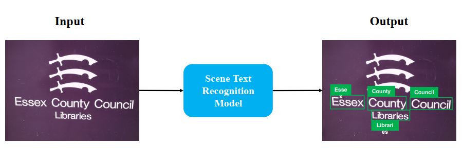
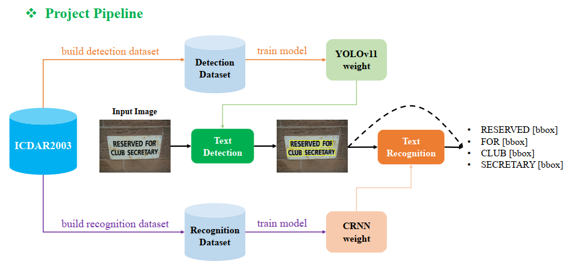

# Scene-Text-Recognition
*Knowledge provided by* [AI VIET NAM](https://aivietnam.edu.vn/) 

<div style="text-align: center;">
    
</div>

**Scene Text Recognition (STR)**: A task in Computer Vision that aims to **locate** and **recognize** textual content within **natural scenes** automatically. It is a foundational component for numerous applications, including navigation aids, information retrieval systems…

I built a basic training pipeline for the Scene-Text-Recoginition task. I used the **YOLOv8** model for **text detection** and constructed a **CRNN** model to **predict the text**.

I used **Airflow** to manage the project's workflow and **MLflow** to track the model training process. The entire pipeline is describle as shown in the diagram below.

<div style="text-align: center;">
    
</div>

___________
## Airflow
```
> git clone https://github.com/mminh007/Scene-Text-Recognition.git
> cd ./airflow

# Set the UID of the user to the .env file
> echo -e "AIRFLOW_UID=$(id -u)" > .env

# Start the service
> docker compose up -d --build
```
Go to `https://localhost:8080` to access the airflow UI
$\bullet$ Username: `airflow`
$\bullet$ Password: `airflow`
_________
## MLFlow
```
> cd MLFlow

# start the service
> docker compose -d ---build
```


